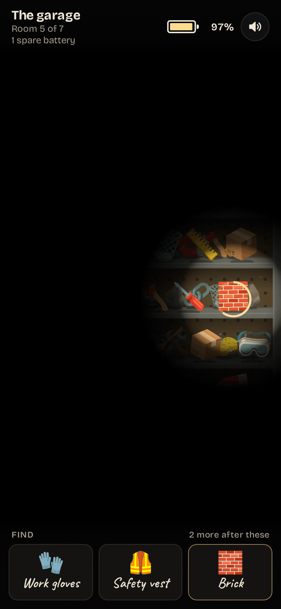
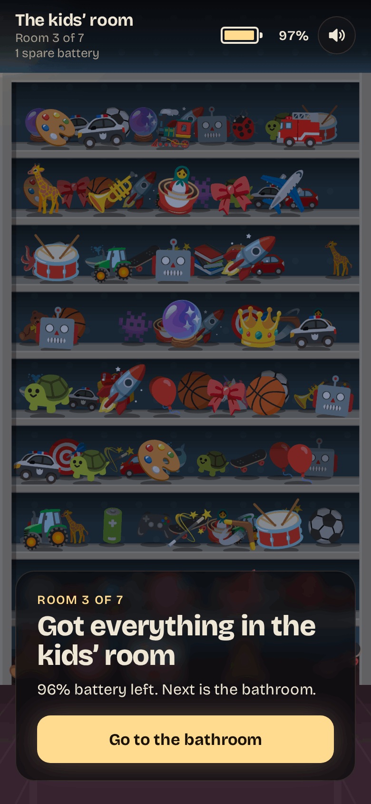
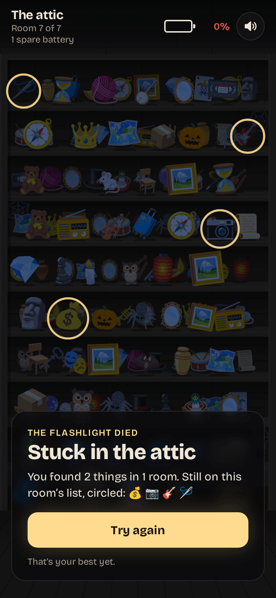

# Pitch Dark

**Play it: [pitch-dark.junkdrawer.works](https://pitch-dark.junkdrawer.works/)**

**The power’s out, and you have a flashlight and a list.** Search the house one dark room at a time: a wall of cluttered shelves that you only see in the beam. Hold the light on a thing from the list to pick it up, and find them all before the battery runs down.

<p align="center">
  
  &nbsp;
  
  &nbsp;
  
</p>

## How it plays

- **Drag to shine the light.** On a phone the beam sits a little above your finger, so you can see what it lights. With a mouse it follows the pointer, and the arrow keys work too.
- **Hold it still on something from the list** and a ring fills around it. When the ring closes, you have it.
- **The list shows three things at a time.** When you find one, the next takes its place, so it pays to remember what you passed.
- **The battery only drains while the light is on.** Below 20% the beam turns orange, shrinks and starts to flicker. Spare batteries are hidden in the clutter, and the top bar says how many are in the room. Hold the light on one to top up.
- **Seven rooms, each harder than the last:** the hall closet, the pantry, the kids’ room, the bathroom, the garage, the study and the attic. Later rooms are more crowded and hide some list things at the back of a shelf. They also put look-alikes on the shelves, like the pen and the fountain pen in the study, or the violin and the guitar in the attic.
- **Three difficulties, picked on the title screen.** Easy gives a wider beam, 130 seconds of light per battery, spares worth half a battery and one extra spare in every room. Medium gives 85 seconds, and spares add 40%. Hard narrows the beam, gives 60 seconds with spares worth 30%, and makes you hold the light longer to pick things up. Each difficulty keeps its own best score.
- **Clearing a room brings a flash of lightning** that shows you the whole room at once. If the flashlight dies, the moonlight shows where the rest of the list was. Get through the attic and the power comes back on.
- No account and no server. Your best scores and the difficulty you picked stay in your browser. It works offline and installs to a phone’s home screen.

## Running it

It’s a static site: plain HTML, CSS and JavaScript, with no build step.

```sh
npx serve .                   # or any static file server, then open the printed address
npm test                      # the rules and layouts in Node, then plays it in Chromium (needs Playwright)
node tools/screenshots.mjs    # redraws docs/*.png and og.png (needs npm install)
node tools/make-icons.mjs     # redraws the PNG icons from icon.svg
npm run build                 # optional: dist/pitch-dark.html, the whole game in one file
```

Add `?seed=123` to the address to get the same house every time, `&room=4` to start in a later room, and `&mode=hard` to pick a difficulty.

To put it online with GitHub Pages: **Settings → Pages → Build and deployment → Deploy from a branch**, then pick `main` and `/ (root)`.

### Files

- `js/rooms.js`: the seven rooms, what’s on their shelves, the look-alike pairs and how hard each room is.
- `js/scene.js`: lays out a room’s shelves, fills them, and places the list things and the spare batteries.
- `js/game.js`: the rules: the three difficulties, the battery, the list, picking things up and moving between rooms.
- `js/draw.js`: draws the room and the flashlight beam.
- `js/app.js`: the page: input, the frame loop, the list and the messages between rooms.
- `js/sound.js`: the switch, the pick-up chime, the thunder and the lights, all made with Web Audio.
- `fonts/`: Bricolage Grotesque and Caveat (SIL Open Font License), served from here so nothing loads from elsewhere.
- `sw.js`: keeps a copy for playing offline.
- `scripts/build.mjs`: bundles the game into one HTML file.
